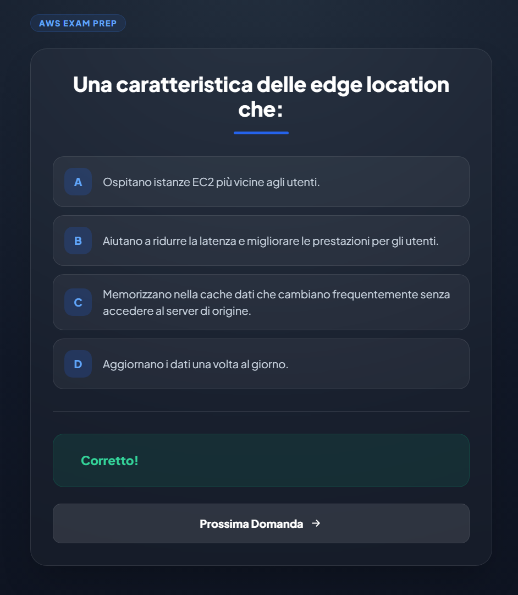

# AWS QuizApp - DevSecOps project

This project demonstrates the design and implementation of a DevSecOps-oriented CI/CD pipeline built around GitHub Actions and Docker, used to build, test, scan, and deploy a Flask-based AWS Quiz application on a self-hosted Raspberry Pi infrastructure.

## Project Background

During the initial phase of my training, 1 year ago, within the **ITS DevSecOps program (EQF Level 5)** provided by **Cisco Academy A. Olivetti**, I developed a lightweight web application for personal use to prepare for the **AWS Cloud Practitioner certification**.

The application is based on approximately 400 exam-style questions and uses a simple Python/Flask backend.
At this stage, the project served purely as a functional learning tool, without automation or infrastructure concerns.

Recently, after completing the module on **Containers and Docker**, I expanded the project by deploying the application alongside additional containerized services (such as WireGuard , Nextcloud and AdGuard) on an **Ubuntu Server VirtualBox's VM**.  
This phase allowed me to gain hands-on experience with Docker, service isolation, networking, and basic infrastructure management.

**In a next phase**, the entire infrastructure was migrated to a **Raspberry Pi 5**, where the architecture was significantly improved and restructured.  
The system now follows a **Docker-based microservices approach**, using **Caddy as a reverse proxy**, **Cloudflare Dynamic DNS**, and a **domain**.  
This evolution transformed a personal study application into a publicly accessible project aligned with modern **DevOps and cloud-native practices**, including automated CI/CD workflows and security-oriented design principles.

## CI/CD Pipeline Focus with GitHub Actions

The **GitHub Actions pipeline is the core of the project and performs the following stages automatically on each push to main:**

1. **Code checkout** and dependency setup (cloning the repository source code into the runner so that the pipeline can work with it.)
2. Automated testing with **pytest**
3. Docker image build using **Buildx** (builder that enables multi-platform builds, advanced caching, and native CI/CD integration.)
4. Multi-architecture image publishing to **Docker Hub**
5. Container image vulnerability scanning with **Trivy**
6. **Automated deployment** to the Raspberry Pi via a **self-hosted runner**

This pipeline enforces security gates: deployments occur only if tests pass and no high/critical vulnerabilities are detected.

## Deployment Environment

- **GitHub and AWS CdeCommit** account with a dedicated repository.
- **Docker Hub and AWS ECR** account for container image publishing .
- Raspberry Pi running **Ubuntu Server**.
- **Docker** and Docker Compose installed.
- **Caddy** reverse proxy configured on  a dedicated and isolated Docker network.
- Custom domain managed via **Cloudflare**.
- SSH access to the Raspberry Pi with a dedicated `deploy` user for improved security.

## Project Documentation Roadmap

1. **Application Containerization & Local Hardening**  
   [step1_application_containerization.md](docs/step1_application_containerization.md)  
   Containerize the Flask AWS QuizApp using Docker, apply basic security best practices, and prepare the foundation for CI/CD.

2. **GitHub Secrets & Self-Hosted Runner Setup**  
   [step2_Github-secrets-and-runner.md](docs/step2_Github-secrets-and-runner.md)  
   Configure GitHub Secrets, Docker registry credentials, and a self-hosted GitHub Actions runner on Raspberry Pi.

3. **Dynamic DNS & Reverse Proxy (Cloudflare + Caddy)**  
   [step3_DDNS_&_ReverseProxy.md](docs/step3_DDNS_&_ReverseProxy.md)  
   Expose the application securely using a custom domain, Cloudflare DDNS, and Caddy as a reverse proxy.

4. **CI/CD Pipeline with GitHub Actions**  
   [step4_GitHub-Actions.md](docs/step4_GitHub-Actions.md)  
   Build a complete CI pipeline with Docker Buildx, image publishing, and automated deployment.

5. **Testing & Security Scanning (pytest + Trivy)**  
   [step5_Test-and-security-scan.md](docs/step5_Test-and-security-scan.md)  
   Integrate unit tests and vulnerability scanning into the CI pipeline to enforce security gates.

6. **Container Hardening & Runtime Security**  
   [step6_Hardening_container.md](docs/step6_Hardening_container.md)  
   Apply advanced Docker hardening techniques such as capability dropping, read-only filesystems, and tmpfs usage.

7. **AWS QuizApp – Application Overview & Demo**  
   [step7_AWS_QUIZAPP.md](docs/step7_AWS_QUIZAPP.md)  
   High-level overview of the application, architecture, and screenshots showing how the app works.

## Docker vs Podman
**Docker** was selected over **Podman** despite its rootless capabilities.
While Podman would provide a stronger security model, Docker was chosen to ensure compatibility with GitHub Actions, multi-architecture builds, and ecosystem maturity.
The associated risk is mitigated by restricting access to the Docker daemon and limiting the runner to a trusted single-host environment.

If you found this project useful, please give it a ⭐ star!

Possible future improvements: migration to Podman rootless or Docker Swarm/Kubernetes for containers orchestration.

enricosoci@protonmail.com
