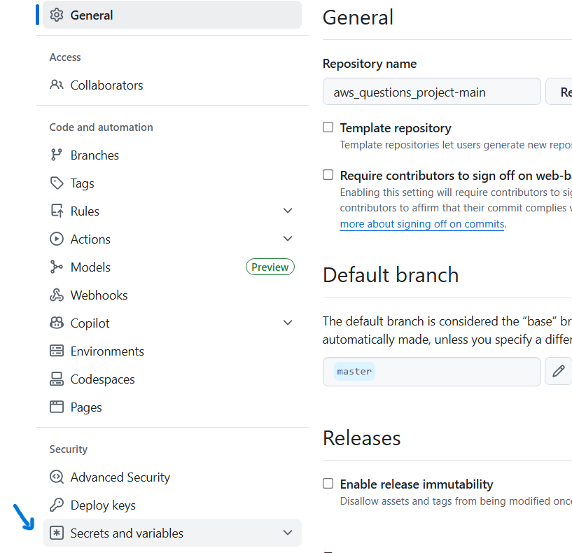
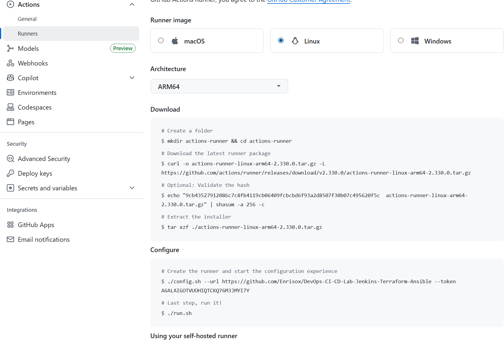

# CI/CD Pipeline with GitHub Actions, Docker Hub, and Trivy

This step documents the setup of a complete DevSecOps pipeline for the AWS Quiz App. The pipeline automates testing, building, security scanning, and deployment to a Raspberry Pi environment.

In a previous DevOps project, I used **Jenkins** as the **CI/CD pipeline** tool and **AWS ECR as the container registry**. The entire infrastructure was hosted on a **self-hosted Proxmox server**.
In contrast, for this **AWS Quiz App project**:

- **GitHub Actions** replaces **Jenkins** as the pipeline orchestrator.
- **Docker Hub** replaces **AWS ECR** as the container registry.
- **A Raspberry Pi** serves as the deployment host instead of a full Proxmox virtualized environment.

This comparison highlights a shift from enterprise-level infrastructure to a compact, personal lab setup, while still applying modern DevSecOps practices: automated testing, container scanning, and secure deployment.

https://github.com/Enrisox/DevOps-CI-CD-Lab-Jenkins-Terraform-Ansible

## GitHub repository and secrets

As first step I created two GitHub repository secrets:
Navigate to Settings → Secrets and variables → Actions → New repository secret.

1. **DOCKERHUB_USERNAME** → my Docker Hub username
2. **DOCKERHUB_TOKEN** → a Personal Access Token generated on Docker Hub

**Why??**

First of all,as a DevSecOps student, **cybersecurity**: never put your Docker Hub password or token directly in the workflow YAML. GitHub Actions secrets are encrypted and are only made available to workflows at runtime (for example as environment variables).​
Secondly, **my GitHub account is protected with a strong, unique password and MFA (2FA)Automation**: 
These credentials allow the pipeline to log in to Docker Hub, so it can:
- Push newly built Docker images 
- Pull images for Trivy scanning

Cybersecurity principle: Using secrets instead of plaintext credentials prevents leaking credentials in your repo and ensures that automated tasks can run securely without human intervention.

## Self-Hosted Runner on Raspberry Pi
Instead of exposing SSH to the Internet, a self-hosted GitHub Actions runner is installed on the Raspberry Pi.

- It executes CI/CD jobs locally, reducing attack surface.
- Only outbound connections to GitHub are required.
- Jobs like docker compose pull and docker compose up -d run in the Raspberry Pi environment directly.

**Create a runner on GitHub**

- **From the repository → Settings → Actions → Runners → New self-hosted runner.**
- Select Linux and the correct architecture for your Raspberry Pi.
- GitHub gives you a set of commands to download, extract, and configure the runner on your machine.

The self-hosted Github runner needs high privileges and has to run Docker commands
