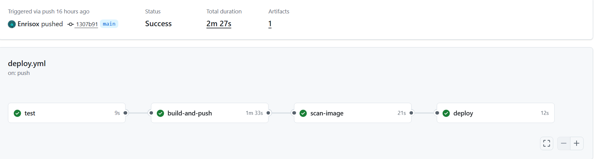

# GitHub Actions CI/CD Pipeline

This step documents how I created a fully automated CI/CD workflow for the QuizApp using **GitHub Actions**, **Docker Hub**, **Trivy**, and a **self-hosted runner** on the Raspberry Pi.
I already showed how i've created the Github secrets and how to install the self-hosted runner into the server.
The workflow automatically **tests the Python app**, **builds and pushes a multi-arch Docker image**, **scans it for security vulnerabilities**, and **deploys it to the Raspberry Pi** if all checks pass.

## Workflow File .github/workflows/deploy.yml

```yaml
name: Build, Test, Scan and Deploy

on:
  push:
    branches:
      - main

jobs:
  test:
    runs-on: ubuntu-latest
    steps:
      - name: Checkout
        uses: actions/checkout@v4

      - name: Set up Python
        uses: actions/setup-python@v5
        with:
          python-version: "3.12"

      - name: Install dependencies
        run: pip install -r requirements.txt

      - name: Run tests
        run: pytest tests

  build-and-push:
    needs: test
    runs-on: ubuntu-latest
    steps:
      - name: Checkout
        uses: actions/checkout@v4

      - name: Log in to Docker Hub
        uses: docker/login-action@v3
        with:
          username: ${{ secrets.DOCKERHUB_USERNAME }}
          password: ${{ secrets.DOCKERHUB_TOKEN }}

      - name: Set up Docker Buildx
        uses: docker/setup-buildx-action@v3

      - name: Build and push images
        uses: docker/build-push-action@v6
        with:
          context: .
          push: true
          platforms: linux/amd64,linux/arm64
          tags: |
            enrisox/quizapp:latest
            enrisox/quizapp:sha-${{ github.sha }}

  scan-image:
    needs: build-and-push
    runs-on: ubuntu-latest
    steps:
      - name: Docker login for Trivy
        uses: docker/login-action@v3
        with:
          username: ${{ secrets.DOCKERHUB_USERNAME }}
          password: ${{ secrets.DOCKERHUB_TOKEN }}

      - name: Scan image with Trivy
        uses: aquasecurity/trivy-action@0.28.0
        with:
          scan-type: image
          image-ref: enrisox/quizapp:sha-${{ github.sha }}
          severity: HIGH,CRITICAL
          ignore-unfixed: true
          format: table
          exit-code: "1"

  deploy:
    needs: scan-image
    runs-on: self-hosted
    steps:
      - name: Docker login on Raspberry
        run: echo "${{ secrets.DOCKERHUB_TOKEN }}" | docker login -u "${{ secrets.DOCKERHUB_USERNAME }}" --password-stdin
    
      - name: Deploy quizapp
        working-directory: /home/USER/app1-test
        run: |
          export IMAGE_TAG=sha-${{ github.sha }}
          docker compose pull
          docker compose up -d

      - name: Cleanup old images
        run: docker image prune -f --filter "until=72h"
```

1. **Job test**
Runs on ubuntu-latest. Checks out the repo, sets up Python 3.12, installs dependencies, and runs pytest tests.
2. **Job build-and-push**
Runs on ubuntu-latest. Builds multi-arch Docker images (amd64 + arm64) and pushes them to Docker Hub (latest and sha-<commit> tags). Runs only if test succeeds.
3. **Job scan-image**
Runs on ubuntu-latest. Scans the Docker image with Trivy for HIGH and CRITICAL vulnerabilities. If vulnerabilities are found, the deploy job is blocked.
4. **Job deploy**
Runs on self-hosted (Raspberry Pi). Logs in to Docker Hub, pulls the latest image, deploys it using docker compose up -d, and cleans up images older than 72 hours.




