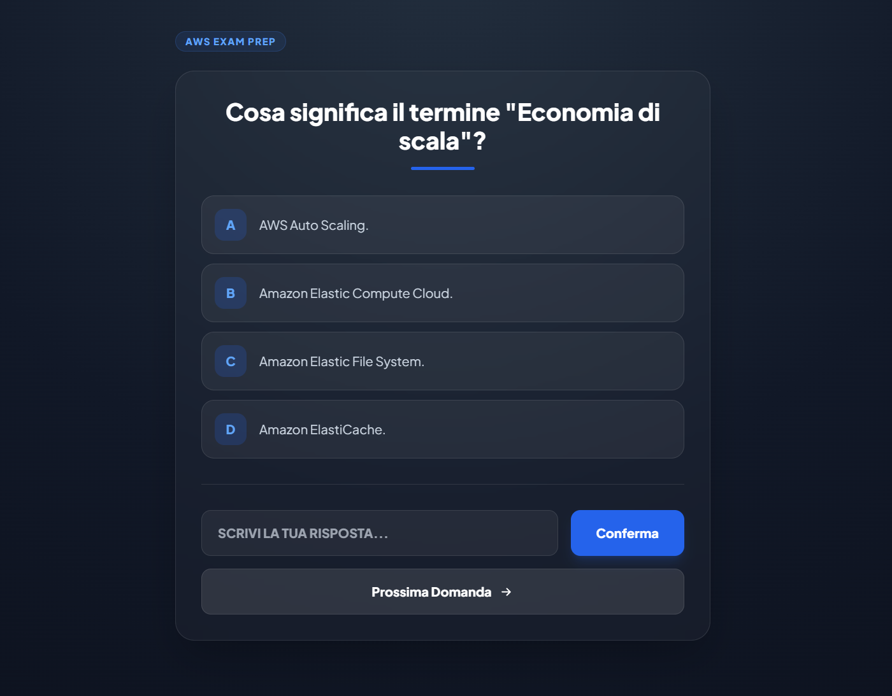

# Application Overview – QuizApp

This section describes the application deployed in the pipeline and demonstrates its runtime behavior through screenshots.

## Application Description

**QuizApp** is a lightweight Python web application designed to demonstrate a secure and production-oriented DevOps workflow.

The application is intentionally simple from a functional perspective, but it is deployed using real-world best practices:

- Containerized with Docker
- Built using a minimal and hardened Python base image
- Deployed behind a reverse proxy (Caddy)
- Exposed securely through Cloudflare
- Continuously tested, scanned, and deployed via GitHub Actions

The goal of this project is **not the application complexity**, but the **security, automation, and infrastructure around it**.

## Technology Stack

- **Backend:** Python (Flask)
- **Web server:** Caddy (reverse proxy + TLS)
- **Container runtime:** Docker
- **CI/CD:** GitHub Actions
- **Image registry:** Docker Hub
- **Security scanning:** Trivy
- **DNS / Edge security:** Cloudflare
- **Hosting:** Self-hosted Raspberry Pi / Ubuntu Server

## Application Behavior

The application exposes a single HTTP endpoint (`/`) which returns a web page rendered from a template.

**Main characteristics:**

- Stateless application
- No database dependency
- Designed to be immutable and redeployed on every change
- Suitable for container-based deployments

**This makes it ideal for demonstrating:**
- CI/CD pipelines
- Image scanning
- Secure reverse proxying
- Infrastructure hardening

## Runtime Architecture

1. User accesses the application via a public domain.
2. Traffic is handled first by **Cloudflare (edge proxy)**.
3. Requests are forwarded to **Caddy (origin reverse proxy)**.
4. Caddy routes traffic to the QuizApp container over an internal Docker network.
5. The application responds with the rendered page.

DISASTER RECOVERY IDEAS... 

METTI REPO ANCHE SU ecr
terraform ansible roxmox o docker swarm
migliorare l'app aggiungendo registrazione utenti e calcolo punteggio sessione..
